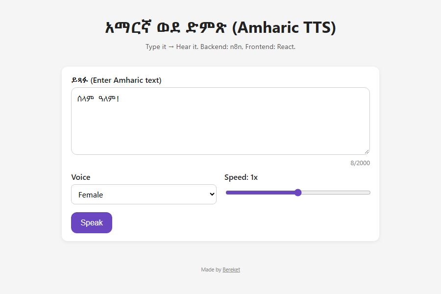

# Amharic Text-to-Speech (አማርኛ ወደ ድምጽ)

A small web app that reads Amharic text aloud. You type or paste text in Ge'ez script, pick a voice and speed, and get audio you can play in the browser or download as an MP3.



Amharic is spoken by tens of millions of people but is still poorly served by most speech tools. This project puts a simple interface in front of a speech pipeline built in [n8n](https://n8n.io).

## How it works

```
React app ── POST { text, voice, speed } ──► n8n webhook ──► text-to-speech engine
    ▲                                                              │
    └──────────── audio (MP3) ◄────────────────────────────────────┘
```

- **Frontend (this repo):** React + Vite. It sends the text to an n8n webhook and plays the audio that comes back. Text is limited to 2,000 characters.
- **Backend:** an n8n workflow that receives the request, calls a text-to-speech engine and returns the audio. Its address is set through an environment variable, so you can swap in any speech engine.

The webhook can answer in either of two ways, and the app handles both:

1. JSON: `{ "audioBase64": "...", "mimeType": "audio/mpeg" }`
2. The raw audio bytes, with an audio `Content-Type`

## Run it

```bash
npm install
cp .env.example .env     # then put your n8n webhook URL in .env
npm run dev
```

`.env` must be in the project root:

```
VITE_N8N_WEBHOOK_URL=http://localhost:5678/webhook/your-webhook-id
```

## Project structure

```
src/App.jsx                 page layout, loading/error states, audio player
src/components/TTSForm.jsx  text box, voice and speed controls
src/api.js                  calls the webhook and turns the reply into playable audio
src/utils/b64toBlob.js      base64 → audio Blob
```
